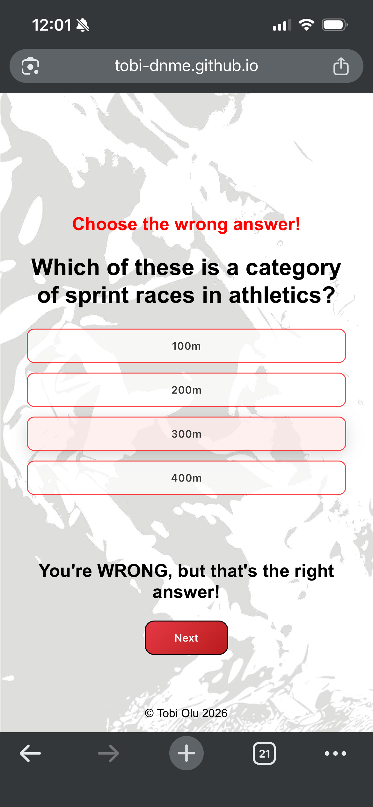
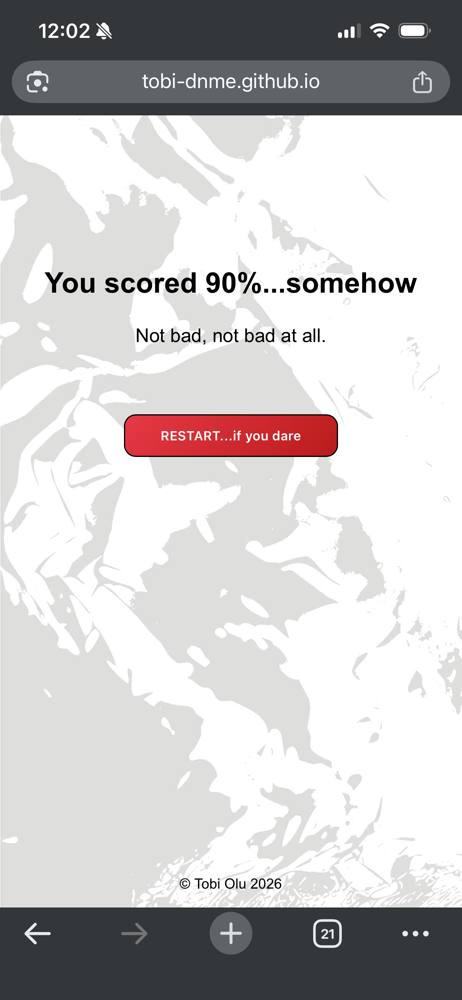

# That Can't Be Right!

A simple quiz where your instincts might betray you. You have been warned.

**Created by Tobi Olu**

---

## Concept

**That Can't Be Right** flips the standard quiz format completely upside down.

Instead of selecting the correct answer, players are challenged to do the opposite:

> ### **Choose the wrong answer**

Each question presents multiple options where most are correct... except for one. Your task is to identify and select the "wrong" one.

It’s a small twist that creates an engaging and maybe confusing experience (at least, that's the idea).

---

## How It Works

1. You begin on an introductory page.  

2. The quiz consists of **10 randomly selected questions**.

3. Each question clearly instructs you to:

   > **Choose the wrong answer**  
  

4. After selecting an option:

   * You'll get feedback regarding your answer,
   * You can proceed to the next question

5. At the end:

   * Your total score is shown,
   * A witty comment reflects your performance

---

## Features

* **Randomized Questions**  
  Questions are selected at random with no repetition.

* **Instant Feedback**  
  Know immediately whether you *correctly* chose the *incorrect* answer.  
  

  
  

* **Twisted Gameplay**  
  Challenges the mind and keeps players on their toes.

* **Final Score Summary**  
  Includes a humorous performance evaluation.  
  

  
  

---

## Built With

* **HTML** – Structure and layout  
* **CSS** – Styling and visibility control  
* **JavaScript** – Logic, randomness, and state management  

---

## Code Validation

### HTML Validation for index.html (Nu Html Checker):

#### *Error*: 
The heading h3 (with computed level 3) follows the heading h1 (with computed level 1), skipping 1 heading level.   
From line 20, column 9; to line 20, column 28   

    (13)`<h1>That Can't Be Right!</h1>`  
    ...  *No h2 elements*
    (20)`<h3> class="warning">Choose the wrong answer!</h3>`
    

  
#### *Solution*:
Considering that this leads to an error of broken hierarchy, and possible screen reader confusion, I changed the element type from 'h3' to 'p', keeping its existing class name, and adjusting its font size in CSS. 
  
----

 
#### *Errors*:  
* Self-closing syntax (/>) used on a non-void HTML element. Ignoring the slash and treating as a start tag.  
From line 40, column 1; to line 40, column 43 
 
* Unclosed element script.
  From line 40, column 1; to line 40, column 43  

    ` `.

----
### CSS Validation for app.css (The W3C CSS Validation Service):

#### *Error*:
(Line) 28 button	  Value Error : border Missing a semicolon before the property name border-radius.

#### *Solution*:
This error points directly to line 28 in app.css which contains the property:value pair of 'border-radius: 10px' under the 'button' ruleset. 
  
    (28) border-radius: 10px
    (29) font-weight: 600;  

The error stems from the fact that the missing semicolon will cause the browser to misunderstand the ruleset, because the end of the rule hasn't been indicated by a ';'.  

I corrected this error by including a semicolon at the end of line 28.

----
### JS Validation for app.js (JSHint):
  
#### *Errors*:
* (Line) 26	'questionElement' has already been declared.  
* (Line) 26	Expected an identifier and instead saw '.'.  
* (Line) 26	Expected an assignment or function call and instead saw an expression

#### *Solution*:
  This issue occured owing to the fact that 'questionElement' had already been declared on line 25 as:

    (25) const questionElement = document.getElementById("question");
    (26) let questionElement.textContent = myQuestion.question;

  Therefore the variable declaration on line 26 is trying to reassign an already declared constant. My mistake was in assuming that 'questionElement' and 'questionElement.textContent' were two different variables, and not that '.textContent' is a property of the initially declared constant.  

  To fix this error, I simply removed the 'let' keyword on line 26 in order to properly reassign a property of the element, and not make a new assignment of the element itself.  

----  
 
#### *Error*:
(Line) 49	Expected a conditional expression and instead saw an assignment.

#### *Solution*:
  This error resulted from the intended inclusion of a conditional if...else statement which was initialized as:

    (49)  if (index = myQuestion.answer) { 
    
  The error is as a result of the fact that 'index = myQuestion.answer' is a direct reassignment of index, and doesn't compare both values on either side of the '=' to assess the condition that follows.  

  In order to fix this error, I could use either of the equating comparison operators, '=='(loose equality) or '==='(strict equality). For the purpose of avoiding any future errors or inaccuracies, I replaced the '=' with '==='.

---

## Accessibility

Accessibility was considered during development to ensure the application is usable by a wide range of users.

Testing was carried out using **Google Lighthouse**, focusing on accessibility standards such as:
- Semantic HTML structure  
- Readable text contrast 
- Proper use of interactive elements, and more

### Lighthouse Results

---

## Getting Started

1. Click **Start Quiz**  
2. Try not to overthink it, or actually...maybe you should.

---

## Example

**Question:** Which of these are cities in France?

* Marseille  
* Paris  
* Turin  
* Toulouse  

Correct instinct: Marseille, Paris, Toulouse  
But in this quiz…

**You should choose: Turin**

---

## Why This Exists

Because regular quizzes are predictable, and occasionally boring.

And sometimes, it’s more fun when something feels like...that can't be right.

Have fun second-guessing yourself.